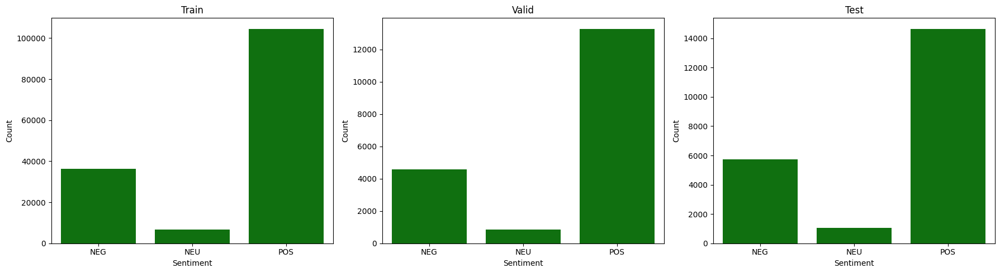
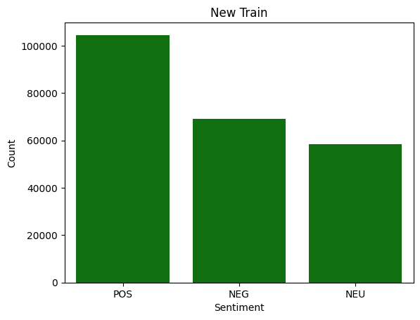
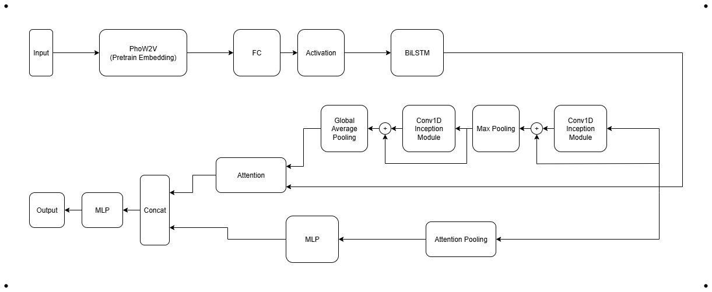

# Vietnamese Sentiment Classification Model

## Introduction
This project presents a Vietnamese sentiment classification model that can generalize across diverse contexts such as movie reviews, e-commerce product feedback, social media comments. 

The model combines LSTM with CNN 1D:  

- LSTM captures sequential dependencies and semantic context.  
- 1D CNN 1D extracts pattern of sentences and highlights important tokens via attention.

## Dataset

The model is trained and evaluated on multiple Vietnamese sentiment datasets:

1. UIT-VSFC: A Vietnamese corpus of students’ feedback.

2. UIT-VISFD: A Vietnamese smartphone feedback corpus with human-annotated comments.

3. UIT-VSMEC: A Vietnamese social media emotion corpus with human-annotated sentences.

4. IMDB dataset: Vietnamese movie reviews dataset.

5. Tiki dataset: A collection of product information and customer reviews from Tiki.vn.

These datasets were merged to create a unified dataset. Data augmentation techniques were applied to reduce class imbalance.

The distribution of labels before and after augmentation is shown below:

<figure style="text-align: center;">
  
  <figcaption>Label distribution (before augmentation)</figcaption>
</figure>

<figure style="text-align: center;">
  
  <figcaption>Label distribution (after augmentation)</figcaption>
</figure>

## Model Architecture

The model is designed with the following components:

1. Embedding
   - Input tokens are first converted into vectors using PhoW2V - Pre-trained Word2Vec syllable and word embeddings for Vietnamese.  
   
   - The embeddings are then passed through a fully connected layer to enhance their representational power before feeding into the BiLSTM encoder.

2. BiLSTM
   - A bidirectional LSTM encodes the sequential information from the enhanced embeddings.
   
   - The BiLSTM produces hidden states for each token, capturing context from both past and future directions.

3. Residual Inception CNN 1D  
   - The BiLSTM hidden states are fed into stacked Residual Inception 1D convolutional blocks, which extract multi-scale local patterns efficiently.

   - Residual connections help stabilize training and allow deeper networks without gradient vanishing issues.

4. Attention Mechanism
   - The CNN-extracted patterns attend over the BiLSTM hidden states, highlighting important tokens.

5. Attention Pooling
   - The BiLSTM hidden states are aggregated using attention pooling, producing a compact representation that captures overall sequence context.

6. Concatenation and Output  
   - The outputs from the attention mechanism over CNN patterns and the attention-pooled BiLSTM context are concatenated.

   - The concatenated vector is passed through a multi-layer perceptron (MLP) to produce the final prediction.

<figure style="text-align: center;">
  
  <figcaption>Model Architecture</figcaption>
</figure>

## Results on Test Set

The model is evaluated on the following metrics:

| Metric       | Value  | Macro   | Micro   | Weighted |
|--------------|-------|---------|---------|----------|
| Accuracy | 0.8801 | -       | -       | -        |
| F1-score | -     | 0.7385 | 0.8801 | 0.8858   |
| Precision| -     | 0.7176 | 0.8801 | 0.8943   |
| Recall   | -     | 0.7690 | 0.8801 | 0.8801   |

## Inference Examples

Below are some example predictions with their probability distributions.

```text
Sentence: Đây là mô hình rất hay, đáp ứng tốt nhu cầu của nhiều doanh nghiệp Việt.
==== Probs ====
1) POS: 0.9341647624969482
2) NEU: 0.06404402107000351
3) NEG: 0.0017912678886204958
```

```text
Sentence: Cũng bình thường mà, không có gì đặc sắc cả.
==== Probs ====
1) POS: 0.009091692045331001
2) NEU: 0.9668748378753662
3) NEG: 0.024033483117818832
```

```text
Sentence: Thật sự không tin nổi là có một cái sản phẩm nó không được một cái điểm nổi bật gì. Ném đi thôi mng.
==== Probs ====
1) POS: 0.03152155131101608
2) NEU: 0.00892287865281105
3) NEG: 0.9595556259155273
```